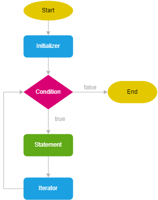
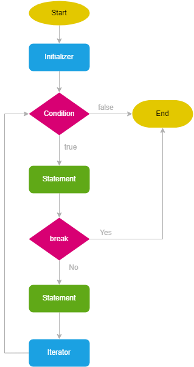
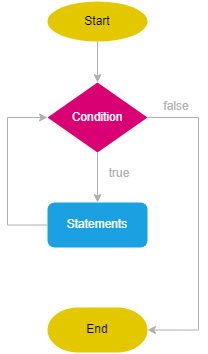
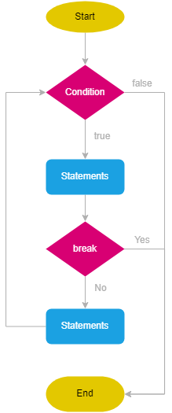
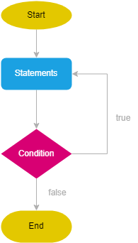

# Lesson 4

- Scopes
- Loops
- Loop types
- break keyword
- continue keyword

    

## `Scopes`

 

`What is the scope ?`

    SCOPE - Bu o'zgaruvchilar, funksiyalar va obyektlarning dastur ichida qayerlarda mavjud ekanligini belgilovchi qoidalar to'plami.!

    Scoplar o'zgaruvchuilarning ishlash chegarasini belgilaydi.!!!

  

`Types of scopes`

- Global scope
- Function scope
- Block scope
- Scope chain
- Lexical scope

  

`Global scope`

    Global scopeda e'lon qilingan o'zgaruvchilar dastur davomida foydalanish uchun istalgan joyda ochiq bo'ladi.!

    let, const bilan  e'lon qilingan o'zgaruvchilar global scopeda ishlaydi var bilan e'lon qilingan o'zgaruvchilar ham global scopeda ishlaydi ham window obyektiga qo'shiladi.!

    var myName = "Jahongir";

    function sayHello(){
      console.log('Salom', myName)
    }

  

`Function scope`

    Funksiyaning ichida e'lon qilingan o'zgaruvchilar faqat shu funksiya ichida ishlaydi funksiyadan tashqarida ishlataolmaymiz.!

     let z = 20;

     function addNumbers(){
         let x = 12;
         let y = 34;
       console.log(x+y+z)
     }

  

`Block scope`

    Block scope nima.?  { } - ushbu ko'rinish block scope deyiladi.!

    Agar biz let va const bilan bror bir o'zgaruvchini shu block scope ichida e'lon qilsak ushbu o'zgaruvchular faqat shu block ichida ishlaydi blockdan tashqarida ishlamaydi.!
    Ammo shu block ichida  var bilan e'lon qilsak blockdan tashqaridaham ishlaydi.!

  

`Scope chain`

    Scope chain - ichki scope tashqi scopedagi o'zgaruvchiularga kirish imkoniyatiga ega bo'lishini anglatadi.!

    Ammo tashqi scope ichki scopedagi o'zgaruvchilarga kiraolmaydi.!

    const myAge = "AGE: "22;

    function getInfo(){
      const myName = "NAME :Samandar Hodiev";

      console.log(myName, myAge)
    }

  

`Lexical scope`

    JavaScriptda scope leksik qoidalarga soslanadi, ya'ni o'zgaruvchilarning mavjudligi kod qayrda yozilgan ekanligiga qarab belgilanadi.!
    Funcsiya qayrda yozilgan bo'lsa u o'sha joydagi scopeni meros qilib oladi.!

    const price = '44$';

    function parentFunction(){
      const productName = 'This glasses is';

    function childFunction(){
        console.log(productName, price)
     }

      childFunction()
    }

    parentFunction()

    

## `Loops`

`why loops ?`

      Make easy of calculating.

      Help to provide DRY in web development.

  

`Types of Loops`

- for - "for" parametrli
- while - "while" sharti oldin tekshiriladigan
- do while - "do while" sharti keyin tekshiriladigan

   

## `for loop`

 

Syntax and concepts

      for (initializer; condition; iterator) {
             statements
        }

      for (let i = 1; i <= 10; i++) {
             console.log(i);
        }

      10 iteration - every process of loop;
      i - iterator variable;

  

Block schema

  

- "break" keyword word in "for"

      for (let i = 0; i < 5; i++) {
           console.log(i);

        if (i == 2) {
           break;
         }
       }

  

  

- "continue" key word in "for"

      for (let i = 0; i < 10; i++) {
       if (i % 2 === 0) {
           continue;
       }

        console.log(i);
      }

  

Different cases

- Without the initializer

      let j = 1; // initilizer

      for (; j <= 10; j++) {
         console.log(j);
       }

 

- Without the condition

      for (let j = 1; ; j++) {
         console.log(j);

          if (j > 10) {
           break;
        }
      }

 

- Without the iterator

      for (let j = 1; j < 10;) {
          console.log(j);

         j += 1; // iterator
      }

 

- Without the initializer, condition

      let j = 1; // initilizer

      for (;; j++) {
        console.log(j);

        // condition
         if (j > 10) {
           break;
         }
       }

 

- Without the initializer, iterator

      let j = 1; // initilizer

      for (; j <= 10;) {
        console.log(j); // statements
        j++; // iterator
      }

 

- Without the condition, iterator

      let j = 1; // initilizer

      for (;; j++) {

      // condition
        if (j > 10) {
           break;
         }

        console.log(j); // statements
      }

 

- Without any expression

      let j = 1; // initilizer

      for (;;) {

        // condition
          if (j > 10) {
           break;
          }

         console.log(j); // statements

         j++; // iterator
      }

   

## `while loop`

    while (condition) {
       // code block to be executed
    }

    let count = 1;

    while (count < 10) {
       console.log(count);
       count +=2;
    }

 
 
  - "break" key word in "while"

        let i = 0;

         while (i < 5) {
              i++;
              console.log(i);
           if (i == 3) {
              break;
           }
        }

    
     
  - "continue" keyword in "while"

        let i = 0;

        while (i < 10) {
           
            i++;

          if (i % 2 === 0) {
              continue;
          }

        console.log(i);
        }

   

## `do while`

    do {
       statements;
    } while (condition);

    let count = 0;

    do {
       console.log(count);
       count++;
     } while (count < 5)

